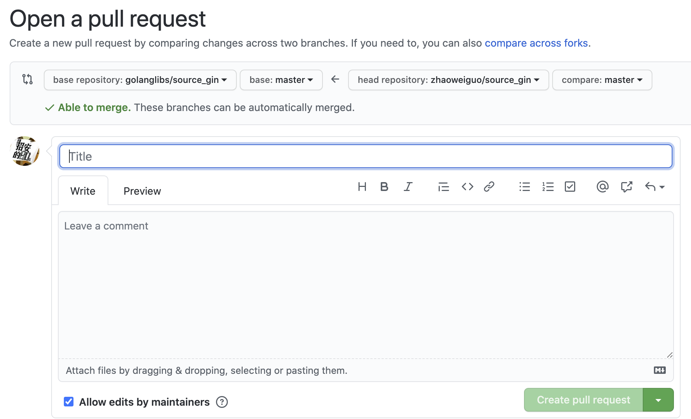

# 怎么进行开源项目

如何贡献::

    Fork 仓库或在本地创建分支
    编辑完成后提交到 GitHub
    发起 Pull Request，申请合并
    专家 Review 提交内容后确认是否接受 Pull Request


### 1. 打开链接: https://github.com/golanglibs/source_gin
### 2. Fork此项目


选择要Fork的域:


Forking...


### 3. Clone代码并提交
```
$ git clone git@github.com:zhaoweiguo/source_gin.git   // zhaoweiguo改成自己的用户名
$ git remote add upstream git@github.com:golanglibs/source_gin.git   // 设定好源项目的upstream
$ git fetch upstream   // 同步代码
... ...   // 修改代码
$ git add .
$ git commit -m "xxxx"
$ git push origin master
```

### 4. 功能完成，提Pull request

4.1 打开pull request页面


4.2 选择要Merge的源点和目的点


4.3 设定提交的标题&内容



4.4 查看提交后的效果


